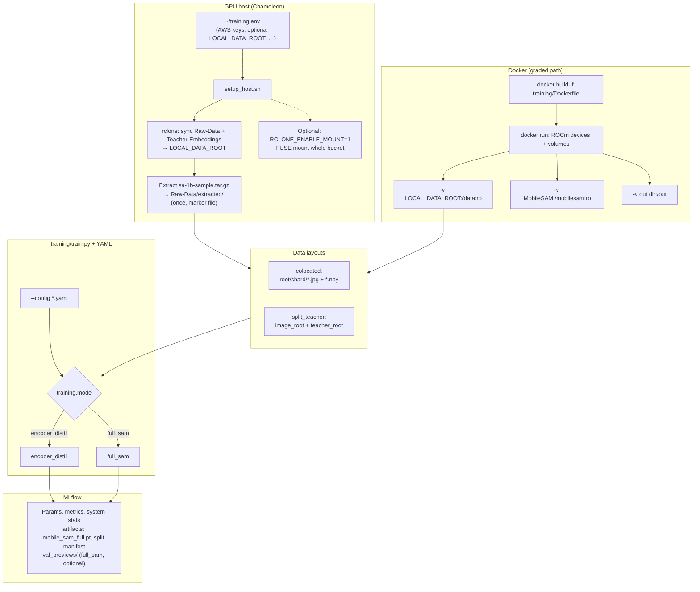

# Training pipeline (overview)

End-to-end flow for Chameleon + Docker + MLflow. Finer behavior is in [`README.md`](README.md) and [`DATA.md`](DATA.md).

## Flowchart

## Finer details

**Host staging** — `setup_host.sh` sources `~/training.env`, configures rclone for S3-compatible storage, **`rclone sync`**s **`Raw-Data`** and **`Teacher-Embeddings`** into **`LOCAL_DATA_ROOT`** (default `~/training-data`), and extracts **`sa-1b-sample.tar.gz`** into **`Raw-Data/extracted/`** once. Optional whole-bucket FUSE mount (`RCLONE_ENABLE_MOUNT=1`) is for browsing; training I/O should use the synced tree.

**Container** — Image from **`training/Dockerfile`**: Ubuntu, ROCm PyTorch, Python deps. Typical mounts: data at **`/data`**, MobileSAM package at **`/mobilesam`**, writable output (e.g. **`/out`**) for configs and checkpoints.

**Training modes** — **`train.py`**. Knobs: **`training.mode`**, **`training.use_pretrained`**, **`training.pretrained_checkpoint_path`**. **`encoder_distill`**: TinyViT vs **`.npy`**, merge, log **`mobile_sam_full.pt`**. **`full_sam`**: mask supervision. **Distill → segment**: second run’s path = first **`mobile_sam_full.pt`**.

**Validation previews** — **`full_sam`:** **`val_previews/epoch_XXXX/`**. **`encoder_distill`** + **`data.annotation_root`:** **`val_previews_merged_sam/epoch_XXXX/`**. **`train.val_preview_samples`** (default **3**; **0** off).

**SAM weights** — **`use_pretrained: true`** + path loads checkpoint; **`false`** = random-init scaffold (**`full_sam`** trains all parts from scratch; **`encoder_distill`** merges into scratch SAM). Student TinyViT remains random-init unless extended later.

**MLflow** — Tracking URI from environment or YAML; flattened params, metrics, optional test IoU, timing, **psutil** / optional **rocm-smi** system metrics.
